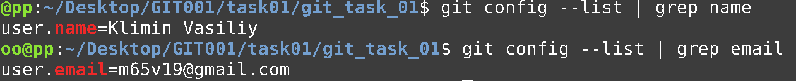

# A sandbox repository for Prototype

The project build supports building with JDK [11..17] and produces the byte-code compatible with `Java 11`.
Download [Java 17](https://www.oracle.com/java/technologies/downloads/#java17) prior to using this repository.

---

## Git

This project uses `Git` as a Version Control System (VCS).
Download and install the latest version of [Git](https://git-scm.com/download/) prior to using this repository.

### Clonning a repository

Following assumes that the respository accessed via SSH and SSH access credentials already configured.
```
git clone 
```

### Updating a repository

Regularly, the repository updates are to be done using `pull` with an additional `--rebase` flag as following:
```
git pull --rebase
```

---

## Build

This repository uses `Gradle` to organize the builds.
[Gradle](https://gradle.org/install/) does not need to be installed prior to using the repository,
it will be downloaded automatically during the build.

### Build steps

To build and package the sources:
```(Gradle)
gradlew clean assemble
```

To build the sources and tests, but not to run tests:
```(Gradle)
gradlew clean build testClasses -x test
```

To build and package the sources, build and run tests:
```(Gradle)
gradlew clean build -Dorg.gradle.parallel=false
```

### Test steps

To run unit tests:
```(Gradle)
gradlew test -Dorg.gradle.parallel=false
```

### Tracking third-party dependencies
This can be tracked per-project basis as following:
```(Gradle)
gradlew :<project>:dependencies --configuration runtimeClasspath
```

### Gradle Build Reference

Basic build task dependency reflected at the following diagram:


For more information check: [Gradle Java Plugin Reference](https://docs.gradle.org/current/userguide/java_plugin.html)

---

## BitBucket

### Editing a file

You’ll start by editing this README file to learn how to edit a file in Bitbucket.

1. Click **Source** on the left side.
2. Click the README.md link from the list of files.
3. Click the **Edit** button.
4. Delete the following text: *Delete this line to make a change to the README from Bitbucket.*
5. After making your change, click **Commit** and then **Commit** again in the dialog. The commit page will open and you’ll see the change you just made.
6. Go back to the **Source** page.

### Creating a file

Next, you’ll add a new file to this repository.

1. Click the **New file** button at the top of the **Source** page.
2. Give the file a filename of **contributors.txt**.
3. Enter your name in the empty file space.
4. Click **Commit** and then **Commit** again in the dialog.
5. Go back to the **Source** page.

Before you move on, go ahead and explore the repository. You've already seen the **Source** page, but check out the **Commits**, **Branches**, and **Settings** pages.

### Next steps

Now that you're more familiar with your Bitbucket repository, go ahead and add a new file locally. You can [push your change back to Bitbucket with SourceTree](https://confluence.atlassian.com/x/iqyBMg), or you can [add, commit,](https://confluence.atlassian.com/x/8QhODQ) and [push from the command line](https://confluence.atlassian.com/x/NQ0zDQ).

---


# Домашнее задание GIT

### Задание №0


