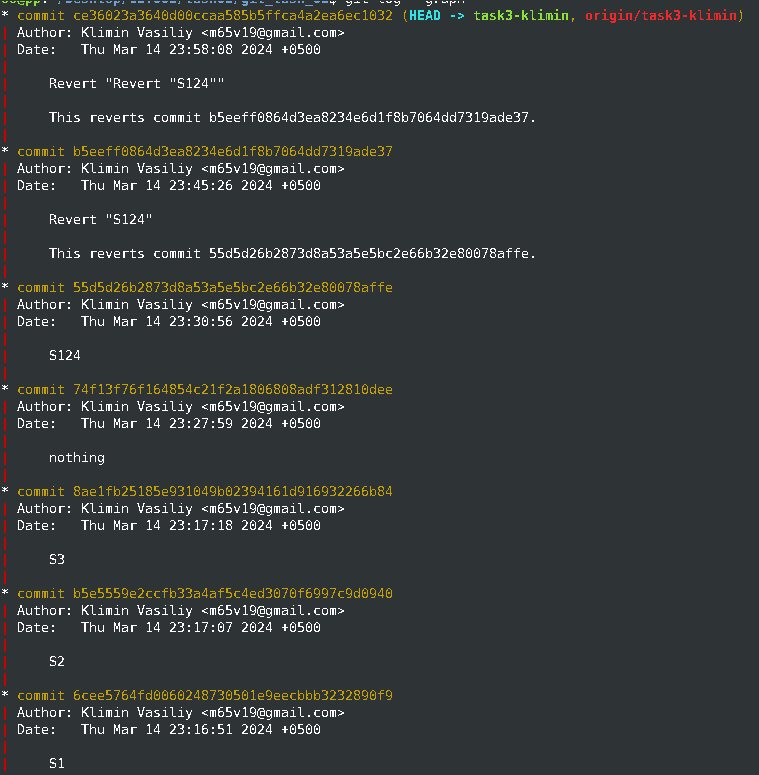

# Домашнее задание GIT

#### Адрес репозитория: [https://github.com/m65v19/git_task_01/](https://github.com/m65v19/git_task_01/) ####
<h6>Делал: Климин Василий, МЕНА-130701</h6>

### Задание №0


### Задание №1


***Pull Request №1*** [https://github.com/m65v19/git_task_01/pull/1](https://github.com/m65v19/git_task_01/pull/1)

***Pull Request №2*** [https://github.com/m65v19/git_task_01/pull/2](https://github.com/m65v19/git_task_01/pull/2)

---
Отвечая на доп. вопрос ***"Какие операции нужно совершить, если не использовать Pull Request (полный
набор команд от начала и до конца)?"***

Ответ: Можно переключиться на ветку Main и сделать merge изменений:
```bash
git checkout main
git merge 
task1-name 
git push
```

### Задание №2


***Beтвь №1*** [https://github.com/m65v19/git_task_01/tree/task2-klimin](https://github.com/m65v19/git_task_01/tree/task2-klimin)

***Beтвь №2*** [https://github.com/m65v19/git_task_01/tree/task2-ovakimyan](https://github.com/m65v19/git_task_01/tree/task2-ovakimyan)

---
Отвечая на вопросы 
1. ***Объяснить почему не удалось запушить ветку***


Контекст: Перед пушем ветви, было необходимо совершить сл. шаги:
1. Создать свою ветку, сделать ***commit*** с новым файлом и совершить ***push***
2. ***checkout*** на ветвь ***main***, ***commit*** и ***push*** любого изменения
3. Вернуться на свою ветвь и выполнить ***rebase*** от ветви ***main***

Процедура ***rebase*** представляет из себя операцию накладывания найденных коммитов поверх других.
В данном случае мы ответвились от основной ветви ***main*** и от последнего на тот момент коммита продолжили работу в новой ветке ***new branch***.
При этом же, совершили изменения в ***main*** уже после разветвления, соответственно ***main*** уже указывала на новый коммит. Локальный ***main*** не совпадал с указателем в удалённом репозитории.


Код в локальном репозитории оказался несовместим с кодом в удалённом репозитории.


2. ***Найти способы запушить ветку без лишних изменений, т.е. не должно появиться ни одного лишнего коммита (подсказка: есть два способа)***

Решение №1

```bash
git pull
git push
```

Решение №2: Сделать ***merge*** веток.

### Задание №3

***Beтвь с заданием*** [https://github.com/m65v19/git_task_01/tree/task3-klimin](https://github.com/m65v19/git_task_01/tree/task3-klimin)

Задание было выполнено в интерактивном режме, используя[^1].
```bash
git rebase -i
```




[^1]: Не удивляйтесь двойному ***revert***. Было интересно посмотреть.


    
